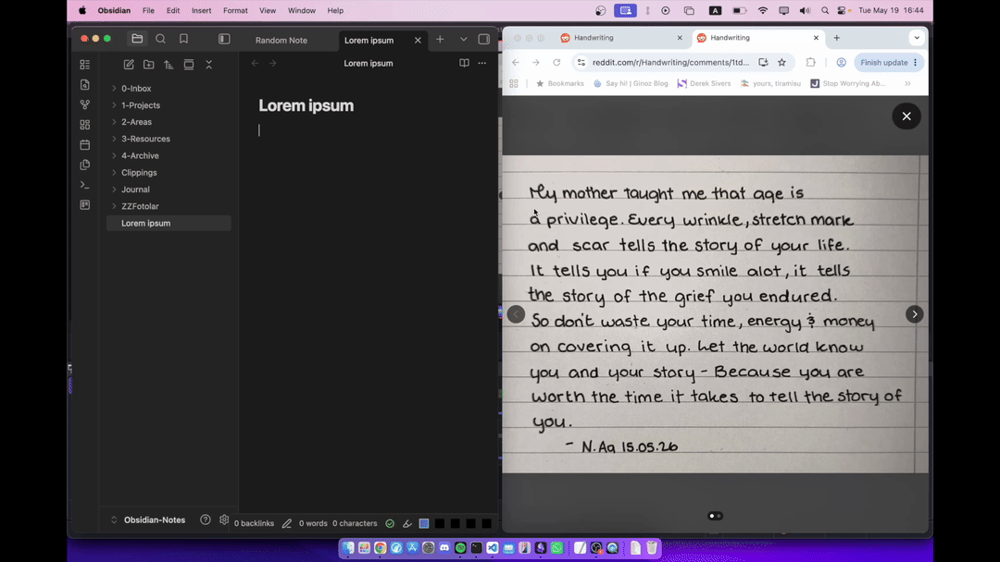
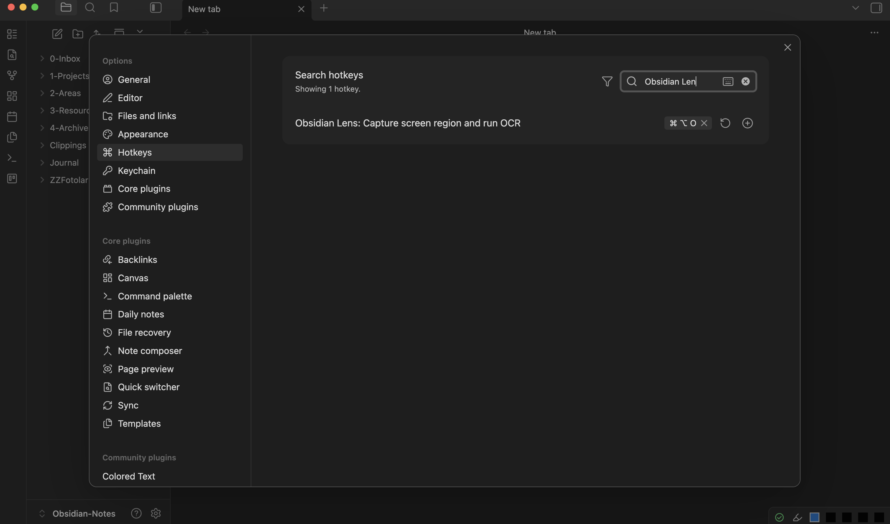

# Obsidian Lens OCR

Digitize handwritten notes from your screen directly into your vault using native operating system (MacOS, Windows) OCR.

Because it uses native OS frameworks, no **AI API** or no **cloud subscription** is required.

## Installation

You can install the plugin by following this [link](https://community.obsidian.md/plugins/lens-ocr)

## Documentation

To use the plugin you must first assign a hotkey for `Capture screen region and run OCR` command. You can do it by going to settings and search *Obsidian Lens OCR* in Hotkeys section.

After assigning a hotkey, you can start to use the plugin. To use the plugin you must press on assigned hotkey then select screen region you want to run OCR on. Extracted text will be pasted to active page after some time.

## Features

* **100% Offline:** Uses native OS APIs. No data is sent to external servers, and no internet connection is required.
* **No Dependencies:** Does not bundle heavy OCR models (like Tesseract) or external runtime dependencies (like Python). It utilizes existing system libraries.
* **Direct Paste:** Inserts the extracted text directly at your current cursor position in the active note.

## How It Works

The plugin leverages the built-in OCR engines of your operating system:
* **macOS:** Apple's Vision Framework
* **Windows:** Windows.Media.Ocr

By using native system frameworks, the plugin avoids downloading external binaries, keeps the bundle size minimal, and processes everything locally without internet access.

## Requirements

Since the plugin utilizes native system frameworks, it supports:
* **macOS:** Catalina (10.15) or later.
* **Windows:** Windows 10 or later.

## Contributing

This is an open-source project. If you encounter any bugs, have feature requests, or want to contribute to the codebase, feel free to open an issue or submit a pull request on GitHub.

## Notes

While this plugin is available on Windows as well, Windows' native OCR is not really good with handwriting. But it is still good with digital fonts, so you can still use it to get text from documents which you are unable to copy paste from.

Also this plugin uses `powershell` and `swift` scripts to call native OCR functions. I did best I could to keep content of these scripts as transparent as possible and use `esbuild` to inject content of these scripts to `main.js`. But it is totaly understandable if you feel unsafe and have questions about it. So you can create an issue about it to further learn the content of scripts, ask to AI or look content of `main.js` before running the plugin.

## License

GPL-3
